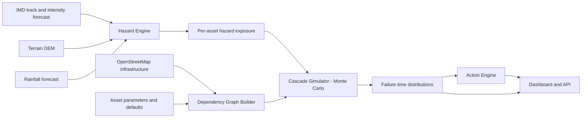
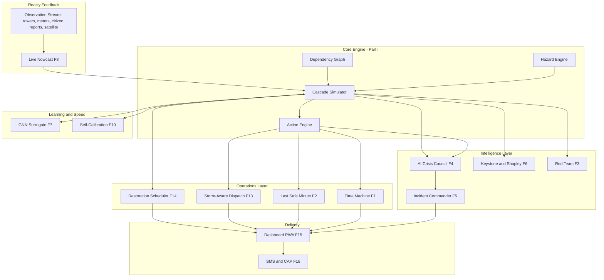

# Failure Clock: Project Specification

**Track:** Track 5, Cyclone Impact & Infrastructure Vulnerability Forecaster
**Tagline:** *Weather forecasts tell you the storm is coming. Failure Clock tells you which lifeline breaks first, and when to act to stop it.*
**Document status:** v1.0, hackathon build specification

---

## 1. Executive Summary

Failure Clock is a decision-support system for cyclone preparedness. Instead of only mapping wind, surge and flood hazard, it forecasts **which critical services will stop working, in what order, and how many hours until each one does**, then converts that timeline into a **ranked list of pre-landfall actions with deadlines**.

It does this by modelling critical infrastructure (power, telecom, health facilities, roads, water pumping) as a **dependency graph**, driving that graph with a probabilistic cyclone hazard forecast, and running a **Monte Carlo cascade simulation** to produce failure-time distributions for every asset.

> **See Part II (Sections 23-30)** for the signature "wow layer": branching Time Machine timelines, a grounded AI Crisis Council, Shapley blame and keystone-asset detection, a live nowcast that learns during the storm, an offline-first design, and more.

---

## 2. Problem Statement

### 2.1 The gap
Existing cyclone tools (IMD bulletins, hazard heatmaps, damage-risk maps) answer **"where will it hit and how hard?"** Disaster managers need the next answer: **"what stops working, when, and what can we do about it before it does?"**

Much of the harm after landfall comes from **cascading failures**, not the initial hazard:

| Trigger | First-order failure | Cascade |
|---|---|---|
| Wind damages lines / substation floods | Grid outage | Telecom towers drain batteries |
| Towers go down | Alerts and helplines fail | Evacuation coordination breaks |
| Roads flood or are blocked | Access cut | Fuel, ambulances and repair crews cannot reach sites |
| Hospital loses grid | Generator starts | Fuel runs out with the resupply road cut, so ICU/dialysis at risk |
| Power to pumping stations lost | Water supply stops | Sanitation and health risk |

### 2.2 Why current tools fall short
- They report hazard intensity, not **service loss**.
- They treat assets **independently**, ignoring that a tower's survival depends on the grid, and a hospital's survival depends on fuel and roads.
- They output maps that need expert interpretation, not **actions with deadlines**.
- They give a single deterministic picture, not **uncertainty-aware** timing.

### 2.3 Problem we solve
> Given a cyclone forecast and a district's infrastructure, predict per-asset failure time and time-to-critical-impact with uncertainty, and recommend the pre-landfall actions that most delay or prevent life-critical service loss.

---

## 3. Goals and Non-Goals

### 3.1 Goals
1. Forecast **failure time distributions** (P10 / P50 / P90) for critical assets.
2. Model **cross-infrastructure dependencies** and cascades.
3. Produce a **prioritised action list** (what, where, deadline, expected benefit).
4. Make every prediction **explainable** (click an asset and see the causal chain).
5. **Validate by replay** against a past cyclone.
6. Run end-to-end for one pilot district within a hackathon timeframe.

### 3.2 Non-Goals
- Not a replacement for IMD forecasts. We consume them.
- Not a real-time control system for utilities.
- Not a full hydrodynamic surge or flood model. We use fast, documented approximations.
- Not a national-scale system. Scope is one district, extensible later.

---

## 4. Users and Use Cases

### 4.1 Personas
| Persona | Need | What Failure Clock gives them |
|---|---|---|
| **District Collector / DDMA officer** | Decide evacuations, resource pre-positioning | Ranked "do this now" list, timeline view |
| **Health officer (CMO)** | Keep hospitals functioning | Per-facility time-to-darkness, generator and fuel deadlines |
| **Power utility control room** | Prioritise restoration | Predicted outage sequence, critical feeders |
| **Telecom operator NOC** | Keep towers alive | Battery-exhaustion times, refuel priorities |
| **Roads / PWD** | Keep corridors open | Predicted cut-off times, critical road segments |

### 4.2 Primary use cases
- **UC-1:** T-48h to T-12h before landfall, generate the failure timeline and action plan.
- **UC-2:** Re-run automatically as the forecast updates (every 6 h).
- **UC-3:** Query "what happens to Hospital X?" and get the causal chain.
- **UC-4:** What-if: "If I pre-position a generator at PHC-14, how much does survival improve?"
- **UC-5:** Post-event replay for validation and training.

---

## 5. Solution Overview

### 5.1 Pipeline



### 5.2 Core modules
1. **Data Ingestion:** pulls forecast, terrain and infrastructure data.
2. **Hazard Engine:** wind, storm surge and pluvial/riverine flood exposure per asset, with track uncertainty.
3. **Infrastructure Graph:** typed nodes and dependency edges.
4. **Cascade Simulator:** time-stepped propagation of failures with stochastic sampling.
5. **Action Engine:** counterfactual ranking of interventions.
6. **Dashboard and API:** map, time slider, explanation panel, action list.

---

## 6. Data Sources

| Data | Source | Use | Notes |
|---|---|---|---|
| Cyclone track and intensity forecast | IMD RSMC bulletins (public), or JTWC/best-track archives for replay | Storm position, max wind, radius of max wind | Track error cone approximated from published error statistics |
| Historical best-track | IBTrACS | Replay validation | Free, global |
| Terrain | SRTM 30 m or Copernicus DEM | Surge inundation, flood routing, road cut-offs | |
| Rainfall | IMD/GPM IMERG (replay), NWP output (live if available) | Flooding | Optional for MVP, use simple rainfall scenarios |
| Infrastructure | OpenStreetMap via Overpass API | Substations, power lines, towers, hospitals, roads, water works | Coverage varies; supplement manually for pilot district |
| Outage ground truth (validation) | News reports, state disaster management situation reports, utility press releases | Compare predicted vs actual failures | Manual curation, keep as a small labelled set |
| Asset parameters | Defaults from public standards plus manual overrides | Battery hours, generator fuel, wind fragility | See Section 8.4. **These are assumptions and must be labelled as such.** |

**Data caveat:** OSM infrastructure completeness is uneven. The pilot district should be chosen based on an audit of available data. Anything not found in public data is entered as a documented assumption, never presented as fact.

---

## 7. Hazard Engine

### 7.1 Wind
- Use a **parametric wind field** (e.g., Holland 1980 model) built from track, max sustained wind and radius of maximum wind.
- Add land-decay of wind after landfall (empirical decay, e.g., Kaplan-DeMaria style).
- Output: peak gust and duration above thresholds at each asset location.

### 7.2 Storm Surge (coastal)
- Fast approximation: surge height as a function of intensity, pressure deficit, approach angle and coastal slope, followed by **DEM-based inundation** ("bathtub" with connectivity constraint so water only floods hydraulically connected low areas).
- Clearly documented as first-order. Not a replacement for SLOSH/ADCIRC.

### 7.3 Rainfall Flooding
- Rainfall accumulation scenarios along the track.
- Flood-prone areas identified using **height above nearest drainage (HAND)** derived from DEM.
- Road segments flagged as cut when inundation depth exceeds a passability threshold (default 0.3 m for standard vehicles, configurable).

### 7.4 Uncertainty
- Sample **N track realisations** within the forecast error cone (cross-track and along-track offsets, intensity perturbations).
- Each Monte Carlo run uses one hazard realisation. This is what turns failure times into distributions.

### 7.5 Hazard output contract
For each asset `a` and realisation `k`:
```
hazard[a][k] = {
  wind_gust_series: [(t, m/s)],
  surge_depth_series: [(t, m)],
  flood_depth_series: [(t, m)]
}
```

---

## 8. Infrastructure Dependency Graph

### 8.1 Node types

| Type | Examples | Key attributes |
|---|---|---|
| `SUBSTATION` | 33/11 kV substation | location, elevation, voltage level, flood-critical height |
| `FEEDER` / `LINE` | 11 kV distribution feeder | length, pole type, served nodes |
| `TOWER` | Telecom tower | location, height, battery_hours, generator flag, operator |
| `HOSPITAL` | PHC, CHC, district hospital | beds, ICU/dialysis flag, generator_present, fuel_hours, criticality weight |
| `WATER_PUMP` | Pumping station | grid dependent flag, backup, population served |
| `ROAD_SEGMENT` | Road edge in graph | length, flood-critical depth, alternative routes |
| `DEPOT` | Fuel depot, repair depot | location, stock, crew count |

### 8.2 Edge (dependency) types

| Edge | Meaning | Example |
|---|---|---|
| `POWERS` | Target requires power from source | Substation → Tower |
| `ACCESSED_VIA` | Target requires road access for resupply/repair | Hospital ← Road segment |
| `SERVES` | Service relation for impact weighting | Tower → Hospital (comms) |
| `RESUPPLIED_FROM` | Consumable resupply path | Hospital ← Fuel depot via road path |

### 8.3 Node state machine
Each node has a state over time:

`OPERATING → ON_BACKUP → DEGRADED → FAILED`

- `ON_BACKUP` starts when the primary dependency is lost (grid loss), with **remaining backup time** as a state variable (battery hours, fuel hours).
- Backup time is depleted at a rate and can be **extended by resupply** if the road path is passable.
- `FAILED` when backup exhausted or physical damage occurs.

### 8.4 Parameters (assumption-driven, editable)

| Parameter | Default (assumption) | Override |
|---|---|---|
| Telecom tower battery backup | 2-4 h (sampled) | Per-tower |
| Tower with generator, fuel autonomy | 12-24 h | Per-tower |
| Hospital generator fuel autonomy | 8-24 h (sampled) | Per-facility |
| Wind fragility (pole/line failure) | Lognormal fragility curve on gust speed | Configurable |
| Substation flood-fail height | Elevation offset above local ground | Per-substation |
| Road passability depth | 0.3 m | Global or per-class |
| Restoration time after storm | Distribution by asset type | Configurable |

> **Honesty note for the pitch and docs:** defaults are engineering assumptions drawn from typical values. The demo must state which values are assumed and show sensitivity analysis on them (Section 12.3).

### 8.5 Data schema (JSON)

```json
{
  "nodes": [
    {
      "id": "PHC-14",
      "type": "HOSPITAL",
      "lat": 19.81, "lon": 85.83,
      "attrs": {
        "generator_present": true,
        "fuel_hours": 9,
        "icu": false,
        "dialysis": true,
        "criticality": 0.9
      }
    }
  ],
  "edges": [
    {"src": "SS-03", "dst": "PHC-14", "type": "POWERS"},
    {"src": "RD-882", "dst": "PHC-14", "type": "ACCESSED_VIA"},
    {"src": "DEP-01", "dst": "PHC-14", "type": "RESUPPLIED_FROM", "path": ["RD-880","RD-882"]}
  ]
}
```

---

## 9. Cascade Simulation Engine

### 9.1 Algorithm (per Monte Carlo run)

```
for k in 1..N:
    sample hazard realisation H_k
    sample asset parameters (battery_h, fuel_h, fragility thresholds, restoration times)
    initialise all nodes OPERATING
    for t in 0..T_horizon step dt (e.g., 30 min):
        # 1. Direct hazard damage
        for each asset a:
            if wind_gust(a,t) > sampled_fail_threshold(a)  -> FAILED (direct)
            if flood_depth(a,t) > flood_fail_height(a)      -> FAILED (direct)
        # 2. Road state update
        for each road segment r:
            r.passable = flood_depth(r,t) < passability_threshold
        # 3. Power propagation
        for each node n with POWERS dependency:
            if source failed and n not already failed:
                n.state = ON_BACKUP (if backup exists) else FAILED
        # 4. Backup depletion
        for each node n in ON_BACKUP:
            n.remaining -= dt
            if resupply_possible(n, t): n.remaining += resupply_amount
            if n.remaining <= 0: n.state = FAILED (cascade)
        # 5. Downstream service impacts
        compute service_status per hospital (power, comms, access)
    record for each node: first_failed_time, state timeline, failure cause chain
aggregate across runs
```

### 9.2 Resupply logic
`resupply_possible(n, t)` is true when:
1. A depot with stock exists, and
2. A **passable path** exists from depot to node at time `t` (shortest-path on currently passable roads), and
3. Crew/vehicle availability constraint is satisfied (simple capacity counter).

This is the mechanism that captures the key insight: **a hospital's survival depends on a road that may flood before the generator runs dry.**

### 9.3 Outputs
For each node:
- `P(fail by T+h)` curve
- `t_fail` P10/P50/P90
- Dominant failure cause (with frequency across runs), e.g., "grid loss 71%, fuel exhaustion 24%, direct wind 5%"
- **Causal chain** from the median or most-probable run for explanation

### 9.4 Aggregate service metrics
- Population without power / water / connectivity over time
- Hospitals with ≥1 functioning lifeline (power, comms, access) over time
- **Critical Lifeline Loss Index (CLLI)**: criticality-weighted count of failed life-critical services, tracked over time

### 9.5 Performance target
Pilot district scale (roughly 500-3,000 nodes), N = 200-500 runs, dt = 30 min, 72 h horizon. Vectorised NumPy or NetworkX plus precomputed path caches should complete in under 60 seconds on a laptop. If needed, reduce N or precompute road-path caches.

---

## 10. Action Engine

### 10.1 Action catalogue

| Action type | Example | Effect modelled |
|---|---|---|
| `PREPOSITION_FUEL` | Deliver X litres to PHC-14 before T+6h | Increases fuel_hours |
| `PREPOSITION_GENERATOR` | Place portable generator at tower cluster | Adds backup source |
| `PRECLOSE/PROTECT_ROAD` | Keep corridor R-880 clear, stage crews | Lowers passability failure or speeds clearance |
| `EVACUATE_FACILITY` | Move dialysis patients from PHC-14 | Removes criticality exposure |
| `PRESHUTDOWN_FEEDER` | Controlled shutdown of low-lying feeder | Avoids damage and speeds restoration |
| `REFUEL_TOWERS` | Prioritise tower refuel route | Extends tower backup |

### 10.2 Ranking method
1. For each candidate action `x`, re-run the simulation (or use cached common random numbers) with action applied.
2. Compute **benefit** = reduction in expected CLLI (or reduction in P(hospital loses all lifelines)).
3. Compute **cost proxy** (distance, litres, crews needed).
4. Compute **deadline** = latest time the action can be completed while its route remains passable (from the simulation's road-state distribution).
5. Rank by benefit per unit cost, subject to resource constraints (greedy in v1, can extend to ILP).

### 10.3 Action output example

```
[1] Deliver 400 L diesel to PHC-14 by T+6h (route via RD-880 closes at T+7h, P50)
    Expected benefit: P(dialysis unit dark before T+30h) drops from 0.82 to 0.19
    Resources: 1 tanker, ~35 min from DEP-01
```

Use **common random numbers** across baseline and action runs so benefit estimates are stable and not dominated by simulation noise.

---

## 11. Dashboard and API

### 11.1 Dashboard requirements

| Feature | Description |
|---|---|
| **Map** | Leaflet/MapLibre map of assets and roads, coloured by state (green → amber → red) at selected time |
| **Time slider** | T-48h to T+72h, animate the cascade |
| **Cone view** | Show forecast track and uncertainty cone |
| **Probability toggle** | View P50 state or "probability failed by this time" heat |
| **Action panel** | Ranked "do this now" list with deadlines and expected benefit |
| **Asset drill-down** | Click asset: failure time P10/P50/P90, cause breakdown, causal chain diagram, dependencies |
| **What-if** | Toggle actions on/off and see updated CLLI curve |
| **Assumptions panel** | Shows all default parameters, editable, with a visible "assumed" tag |
| **Scenario switcher** | Live forecast vs. replay of historical cyclone |

### 11.2 UX principles
- Answer "what should I do in the next hour?" in **one screen**.
- Never show a number without its uncertainty range.
- Every alert links to its explanation.
- Mobile-friendly summary card for field officers (optional stretch).

### 11.3 REST API

| Endpoint | Method | Purpose |
|---|---|---|
| `/api/scenario` | POST | Create scenario from track file or IMD-style parameters |
| `/api/scenario/{id}/run` | POST | Run hazard plus cascade simulation |
| `/api/scenario/{id}/assets` | GET | Asset states over time, with distributions |
| `/api/scenario/{id}/assets/{asset_id}/explain` | GET | Causal chain and cause breakdown |
| `/api/scenario/{id}/actions` | GET | Ranked action list |
| `/api/scenario/{id}/whatif` | POST | Apply actions, return delta metrics |
| `/api/graph` | GET/PUT | View or edit infrastructure graph and parameters |

---

## 12. Validation and Evaluation
> Part II features (Section 28) add their own evaluation metrics.


### 12.1 Historical replay
- Choose a past cyclone that hit the pilot area and has documented impacts (e.g., **Cyclone Fani, 2019, Odisha coast**, or another event with sufficient public records).
- Run the system as if at **T-48h** using the forecast track available then (or the best-track with realistic error added if archived forecasts are unavailable).
- Compare predictions to documented outcomes: outage start times, tower/hospital service disruptions, road blockages reported in situation reports and news.

### 12.2 Metrics

| Metric | Definition | Target for demo |
|---|---|---|
| Failure detection recall | Fraction of documented failures predicted with P(fail) > 0.5 | Report honestly, aim for meaningful signal |
| Failure-time error | Median absolute error in hours, for assets with known timing | Report with sample size |
| Ranking quality | Whether assets that failed early are ranked higher than those that survived (AUC or rank correlation) | > 0.7 is a strong result |
| Calibration | Do "P=0.8" assets fail about 80% of the time? | Reliability plot |
| Action value | Simulated reduction in CLLI when top-3 actions applied | Report with confidence intervals |

### 12.3 Sensitivity analysis
Vary key assumed parameters (battery hours, fuel autonomy, fragility thresholds) ±30% and show which conclusions are robust. This directly addresses the main weakness (assumption-driven parameters) and builds judge trust.

### 12.4 Honest-reporting rules
- Report the number of ground-truth data points used. If it is small, say so.
- Distinguish validated behaviour from assumed behaviour.
- Do not claim quantitative accuracy the data cannot support. Emphasise ranking and timing signal.

---

## 13. Technical Architecture

### 13.1 Stack

| Layer | Choice |
|---|---|
| Language | Python 3.11 |
| Geospatial | GeoPandas, Shapely, Rasterio, OSMnx / Overpass |
| Graph | NetworkX (v1), igraph if speed needed |
| Numerics | NumPy, SciPy, Numba (optional) |
| Backend | FastAPI |
| Frontend | React or plain JS with MapLibre GL / Leaflet, deck.gl for time animation |
| Charts | Plotly or D3 |
| Storage | GeoPackage / Parquet files (no DB needed for MVP), SQLite optional |
| Deployment | Docker, single container, runnable on a laptop |

### 13.2 Repository layout

```
failure-clock/
  data/            # raw and processed (DEM, OSM extracts, tracks)
  ingest/          # OSM, DEM, track loaders
  hazard/          # wind.py, surge.py, flood.py, ensemble.py
  graph/           # build.py, schema.py, parameters.yaml
  sim/             # cascade.py, resupply.py, aggregate.py
  actions/         # catalogue.py, rank.py
  api/             # FastAPI app
  web/             # dashboard
  validation/      # replay scripts, ground truth CSV, metrics
  docs/
```

### 13.3 Key design decisions
- **Configuration over hard-coding:** all parameters in `parameters.yaml` with provenance notes.
- **Reproducibility:** seeded random generators, scenario files stored as JSON.
- **Common random numbers** for what-if comparisons.
- **Graceful degradation:** if rainfall data is missing, run wind and surge only and flag reduced fidelity.

---

## 14. Novelty and Differentiation

| Existing approach | Limitation | Failure Clock |
|---|---|---|
| Hazard heatmaps | Show intensity, not consequence | Predicts **service loss and timing** |
| Damage/exposure dashboards | Static, asset-independent | **Dependency-aware cascades** |
| Emergency SOP checklists | Generic, not forecast-driven | **Forecast-specific, deadline-bearing actions** |
| Deterministic forecasts | Single scenario | **Probabilistic** failure times |

The core novelty is the combination of (1) cross-infrastructure cascade modelling with backup depletion and road-dependent resupply, (2) uncertainty-propagated failure timing, and (3) counterfactual action ranking with deadlines. Each piece exists in academic literature in isolation; the contribution is an integrated, operational, explainable tool for Indian district-level cyclone response.

---

## 15. Risks and Mitigations

| Risk | Impact | Mitigation |
|---|---|---|
| OSM data sparse in pilot area | Incomplete graph | Audit first; hand-add critical assets; state coverage openly |
| Assumed parameters challenged by judges | Credibility | Label as assumptions, sensitivity analysis, editable panel |
| Ground truth for validation is scarce | Weak validation | Use small curated set; report as qualitative plus limited quantitative; avoid overclaiming |
| Scope creep | Unfinished demo | Freeze to four asset types plus roads, one district |
| Simulation too slow | Poor demo | Path caching, fewer runs for demo, precomputed replay results |
| Forecast archives unavailable | Replay less realistic | Use IBTrACS best-track plus synthetic error cone |
| Live demo failure | Embarrassment | Pre-computed results cached, offline mode |

---

## 16. Build Plan (48-Hour Hackathon)

| Phase | Hours | Deliverable |
|---|---|---|
| **0. Setup and scoping** | 0-3 | Pilot district chosen, data audit, repo scaffold |
| **1. Data and graph** | 3-12 | OSM ingest, graph built, parameters file, DEM loaded |
| **2. Hazard engine** | 12-20 | Parametric wind, simple surge and flood, ensemble sampling |
| **3. Cascade sim** | 20-30 | State machine, power propagation, resupply logic, aggregation |
| **4. Action engine** | 30-35 | Three action types, ranking with common random numbers |
| **5. Dashboard** | 28-42 (parallel) | Map, slider, drill-down, action panel |
| **6. Validation** | 38-44 | Replay run, metrics, sensitivity plot |
| **7. Polish and pitch** | 44-48 | Demo script, slides, cached results, fallback video |

### Suggested team split (3-4 people)
- **Data/Hazard:** ingest, wind/surge/flood, ensembles
- **Simulation/Actions:** graph, cascade, action ranking
- **Frontend:** dashboard, visuals, UX
- **Validation/Pitch:** ground truth curation, metrics, narrative, slides

---

## 17. MVP Scope vs. Stretch

### MVP (must ship)
- One district, four asset types (substations, towers, hospitals, roads)
- Wind plus simplified surge/flood exposure
- Monte Carlo cascade with battery/fuel depletion and road-dependent resupply
- Ranked actions with deadlines (three action types)
- Map with time slider, asset drill-down
- One historical replay with honest metrics

### Stretch
- **Wow layer features from Part II** (recommended bundle: F1, F2, F4, F6, F8, F11, F15)
- Water pumping stations, fuel depots as full nodes
- What-if toggle live in the UI
- Automatic re-run on forecast update
- Multilingual (English/Odia/Tamil/Hindi) field summary cards
- SMS/WhatsApp alert draft generator for officers
- Multi-district scaling

---

## 18. Demo Script (5 minutes)

1. **Hook (30 s):** "Weather forecasts tell you the storm is coming. They don't tell you which lifeline breaks first."
2. **Problem (30 s):** Cascade diagram: grid → tower → alerts, road → fuel → hospital.
3. **Live scenario (90 s):** Load replay at T-48h. Scrub time slider, show assets going green → amber → red.
4. **Drill-down (45 s):** Click a hospital. Show "dark at T+14h (P50), range T+9h to T+22h" and the causal chain.
5. **Actions (45 s):** Show top-3 actions with deadlines. Toggle one, and the CLLI curve drops.
6. **Validation (45 s):** Predicted vs. documented outcomes, calibration plot, sensitivity analysis.
7. **Close (15 s):** Scalability, next steps, pitch line.

---

## 19. Impact and Scalability

- **Lives:** targets the failure modes (hospital power loss, comms blackout, access loss) that drive post-landfall risk.
- **Cost of adoption:** open data plus a laptop-runnable stack, so it fits district budgets.
- **Scaling path:** more districts through automated OSM ingestion, utility-provided asset data replacing assumptions, live IMD feed integration, extension to floods and heatwaves using the same dependency-graph engine.

---

## 20. Ethics, Limitations and Responsible Use

- Outputs are **decision support, not orders**. Human officers retain authority.
- Predictions carry uncertainty and are shown with it.
- Asset data may contain sensitive infrastructure detail. Use public data only for the demo, and apply access control for any real deployment.
- Assumption-driven parameters are visible and editable.
- Models are first-order approximations and should be calibrated with utility and health-department data before operational use.

---

## 21. Glossary

| Term | Meaning |
|---|---|
| **CLLI** | Critical Lifeline Loss Index, criticality-weighted count of failed life-critical services over time |
| **Cascade** | Failure of one asset causing failure of dependents |
| **Backup depletion** | Countdown of battery/fuel after primary supply is lost |
| **P10/P50/P90** | 10th, 50th and 90th percentile of a distribution |
| **Common random numbers** | Using identical random draws across compared simulations to reduce noise |
| **HAND** | Height Above Nearest Drainage, terrain-based flood-proneness indicator |
| **DEM** | Digital Elevation Model |
| **RSMC** | Regional Specialised Meteorological Centre (IMD, New Delhi) |

---

## 22. Open Decisions for the Team

1. Pilot district and reference cyclone (depends on OSM coverage and availability of documented impacts).
2. Whether to include water pumping in the MVP or leave it for stretch.
3. Frontend framework (React vs. lightweight JS).
4. Whether rainfall flooding is in MVP or surge-only for the coastal pilot.


---
---

# PART II: SIGNATURE FEATURES ("THE WOW LAYER")

Part I is the core engine. Part II adds the capabilities that turn Failure Clock from a good forecaster into something judges have not seen before. Two rules keep it credible:

1. **Everything sits on top of the simulator.** No feature is allowed to invent numbers. AI, voice, and visuals only present or query what the simulation computed.
2. **Anything demoed with synthetic data is labelled as synthetic on screen.**

**Tier definitions**

| Tier | Meaning |
|---|---|
| **A** | Buildable within the hackathon on real data plus the real simulator |
| **B** | Prototype driven by simulated or synthetic inputs, labelled as such in the demo |
| **C** | Vision or roadmap: mock-up and slide only |

---

## 23. Feature Catalogue at a Glance

| # | Feature | One-line pitch | Tier | Effort (person-hours) |
|---|---|---|---|---|
| F1 | **Time Machine** | Drag an intervention onto the timeline and watch the future rewrite itself as branching timelines | A | 8 |
| F2 | **Last Safe Minute** | A live "doomsday clock" board: the latest moment each action can still succeed | A | 3 |
| F3 | **Red Team Storm** | An adversarial search that finds the worst plausible storm for your district and stress-tests your plan | A | 6 |
| F4 | **AI Crisis Council** | Role-playing AI agents for Collector, Health, Power, Telecom and Roads negotiate a plan, every number traced to the simulator | A/B | 10 |
| F5 | **Incident Commander (voice and local languages)** | Ask "What happens to the Puri hospital if the road closes?" by voice, get answers and ready-to-send alerts | A/B | 8 |
| F6 | **Keystone Finder and Shapley Blame Graph** | Finds the few assets that, if protected, prevent the largest cascades, and attributes blame for every failure | A | 8 |
| F7 | **Instant What-If (GNN surrogate)** | A graph neural network trained on simulator runs gives millisecond answers so sliders feel live | B | 12 |
| F8 | **Live Nowcast: the forecast learns during the storm** | As real observations arrive, the ensemble is reweighted and the failure clock corrects itself | A/B | 8 |
| F9 | **Eyes From Space** | Sentinel-1 flood extent and VIIRS night-lights correct road and outage states | B | 10 |
| F10 | **Self-Calibrating Loop** | Every cyclone's after-action report automatically updates the model's parameters | A | 5 |
| F11 | **Patient-Hours-at-Risk and Cold Chain Clock** | Measures impact in patient-hours and time-to-spoilage of vaccines and blood | A | 5 |
| F12 | **Vulnerable Persons Layer** | Privacy-preserving view of oxygen-dependent, dialysis, and bed-bound residents nearest to failing lifelines | B | 4 |
| F13 | **Storm-Aware Dispatch** | Time-dependent, uncertainty-aware routing of fuel tankers and crews with last-safe-departure times | A | 8 |
| F14 | **Restoration Scheduler** | After landfall, the optimal repair order that restores the most lifeline per crew-hour | A | 6 |
| F15 | **Offline-First, SMS Fallback** | The tool survives the very cascade it predicts: works with no internet and pushes alerts by SMS | A | 6 |
| F16 | **Resilience Investment Advisor** | "Where should the next 1 crore rupees go?" answered across hundreds of storms | A | 8 |
| F17 | **Failure Clock Lens (AR)** | Point a phone at a hospital and see its countdown floating above it | C | mock-up |
| F18 | **CAP Alert Export** | Emits Common Alerting Protocol messages so alerts can flow into existing warning platforms | A | 2 |

---

## 24. Detailed Feature Specifications

### 24.1 Time and Intervention

#### F1. Time Machine (Branching Timelines)
- **What it does:** The user scrubs the timeline to any moment, drags an action card ("deliver 400 L fuel to PHC-14 at T+4h") onto it, and the system forks a new timeline. The original and the branch play side by side, with failing assets changing colour in real time.
- **How:** Uses common random numbers so the only difference between branches is the intervention. State snapshots are stored at every step so forking is a copy plus replay from the fork time. Branches are stored as a tree (each with a parent id and a diff of actions).
- **Why it wows:** Judges see cause and effect: "this one truck changes the ending."
- **Acceptance test:** Applying a fuel action at time t leaves the state before t byte-identical and changes the outcome only for downstream assets.
- **Tier A, ~8 h.**

#### F2. Last Safe Minute (Doomsday Board)
- **What it does:** A single board listing every recommended action with a live countdown to its last feasible start time, coloured by urgency. Example: "Send fuel to PHC-14: **1h 12m left** (route closes T+7h, P50; P10 says T+5h)."
- **How:** For each action, take the road-passability distribution along its route and compute the latest departure time such that arrival happens before closure with a chosen confidence (default 80%). Expose the confidence as a slider so officers can be conservative.
- **Tier A, ~3 h.**

#### F3. Red Team Storm (Adversarial Stress Test)
- **What it does:** Answers "what is the worst plausible storm for us, and does our plan survive it?" The system searches the forecast uncertainty cone and the parameter uncertainty for the scenario that maximises CLLI, then re-scores the current action plan against it.
- **How:** Optimisation over track offset, intensity perturbation, landfall timing, and rainfall multiplier within plausible bounds (for example, Bayesian optimisation or CMA-ES on the simulator or its surrogate). Outputs a **Plan Robustness Score**: fraction of adversarial scenarios where no hospital loses all lifelines.
- **Why it wows:** It shifts the conversation from "what is expected" to "what breaks our plan."
- **Tier A, ~6 h.**

### 24.2 Intelligence

#### F4. AI Crisis Council (Grounded Multi-Agent Planning)
- **What it does:** A panel of AI agents, each playing a stakeholder (District Collector, Chief Medical Officer, Power Utility, Telecom NOC, Roads/PWD, NGO logistics), debates the plan. Each agent has its own objectives and resource limits. Conflicts are surfaced ("Power wants the fuel truck for substations, Health wants it for PHC-14"), and the council converges on a plan.
- **How (grounding is the key design point):**
  - Agents are tool-calling LLMs (for example Claude via API). Their only source of numbers is a set of tools: `get_asset(id)`, `run_whatif(actions)`, `list_actions()`, `get_route_deadline(action)`.
  - Every numeric claim in the transcript is tagged with the simulation call id that produced it, and the UI shows the tag on hover.
  - A deterministic **mediator** (the Action Engine's optimiser) resolves resource conflicts. The LLMs argue and explain, the optimiser decides.
  - Output: a consensus plan, a **dissent log** (who disagreed and why), and the counterfactual cost of each disagreement.
  - A human always approves. The council is advice, not authority.
- **Why it wows:** It looks like a real crisis meeting, but every claim is verifiable.
- **Failure handling:** If a claim has no tool-call tag, the UI greys it out and flags it as unverified.
- **Tier A/B, ~10 h.**

#### F5. Incident Commander (Voice and Local Languages)
- **What it does:** Natural language and voice interface in English, Hindi, Odia, Tamil, Telugu and Bengali. Officers ask questions ("Which hospitals lose power before midnight?") and get spoken and written answers. It also drafts **ready-to-send** advisories (SMS, WhatsApp, IVR script) for the affected community.
- **How:** Speech-to-text (for example an open Whisper model), LLM with the same grounded tools as F4, text-to-speech. Alerts are generated from templates filled with simulator values, then translated, so numbers are never paraphrased by the model.
- **Safety:** Alert text is always shown for human approval before sending. Translation of alert templates should be reviewed by a native speaker before any real use.
- **Tier A/B, ~8 h** (text chat is Tier A, voice and full multilingual are Tier B).

#### F6. Keystone Finder and Shapley Blame Graph
- **What it does:**
  1. **Keystone assets:** the small set of nodes whose protection prevents the largest fraction of total lifeline loss. Often surprising: a low-profile substation or a single bridge.
  2. **Shapley Blame Graph:** for any hospital blackout, attributes responsibility across upstream causes using **Shapley values** (for example: substation flood 46%, road cut 31%, fuel shortfall 18%, tower failure 5%).
- **How:** Estimate Shapley values by permutation sampling: protect assets in random order and average the marginal reduction in CLLI. Use the surrogate model (F7) to make this fast, and fall back to reduced sampling with confidence intervals if the surrogate is unavailable.
- **Why it wows:** It answers "which one thing matters most?" with a principled attribution method rather than a heuristic.
- **Tier A, ~8 h.**

#### F7. Instant What-If (Graph Neural Network Surrogate)
- **What it does:** A learned surrogate of the cascade simulator that answers what-if queries in milliseconds, so sliders, the Time Machine, the Red Team search and Shapley values all run interactively.
- **How:** Generate tens of thousands of simulator runs with randomised hazards, parameters and interventions. Train a GNN that takes the graph, hazard features and interventions and predicts per-node failure-time distributions. Validate against held-out simulator runs and always report surrogate error.
- **Guardrail:** The full simulator remains the source of truth. The UI shows a badge ("surrogate, error ±x h") and offers a one-click "verify with full simulation."
- **Tier B, ~12 h.** Only attempt after the core engine works.

### 24.3 Reality Feedback

#### F8. Live Nowcast: The Forecast Learns During the Storm
- **What it does:** As the storm arrives, real observations stream in (tower heartbeat losses, smart-meter last-gasp signals, utility SCADA alarms, citizen reports through a WhatsApp/Telegram bot). The system updates its beliefs and re-issues the failure clock. Visible effect: uncertainty bands shrink as evidence accumulates.
- **How:** Treat the Monte Carlo runs as particles. Each observation reweights particles by its likelihood (importance sampling). When effective sample size drops, resample and jitter parameters (particle-filter style). Reports from citizens carry a trust weight and are cross-checked against neighbours.
- **Demo mode:** Because live data is unavailable in a hackathon, a **replay feed** emits recorded or synthetic observations on a schedule, clearly labelled.
- **Why it wows:** The audience literally watches the P10 to P90 range collapse around the truth.
- **Tier A (algorithm) with B inputs, ~8 h.**

#### F9. Eyes From Space
- **What it does:** Uses satellite data to correct the model after the fact:
  - **Sentinel-1 SAR** flood extent (passes through cloud) updates road passability and flooded substations.
  - **VIIRS night-lights** (Black Marble style products) show where the lights went out, giving an independent outage ground truth.
- **How:** Ingest imagery, threshold water extent, intersect with road and asset geometry, feed as observations into F8. Compare predicted outage footprint vs night-light drop for validation.
- **Honest limits:** Revisit times and processing latency mean space data usually arrives hours to days later. It is most valuable for **validation and recalibration** (F10) and for restoration planning (F14), less so for the first hours of the event.
- **Tier B, ~10 h.**

#### F10. Self-Calibrating After-Action Loop
- **What it does:** After each event, an automated **After-Action Report** compares predicted vs observed failures, then updates asset parameters (battery hours, generator autonomy, fragility) using Bayesian updating. The model improves with every storm.
- **How:** Store predictions and observations per asset. Update parameter priors with observed outcomes (conjugate updates or MCMC). Output a report with calibration plots and a "parameters that changed" table.
- **Tier A, ~5 h** (demonstrate on the replay event).

### 24.4 Humans First

#### F11. Patient-Hours-at-Risk (PHAR) and Cold Chain Clock
- **What it does:** Measures impact in human terms:
  - **PHAR:** for each facility, patients dependent on power (ventilators, oxygen concentrators, dialysis, incubators) multiplied by hours without it.
  - **Cold Chain Clock:** for vaccine coolers and blood banks, time until temperature limits are exceeded after power loss.
- **How:** Facility profiles include counts of power-dependent patients and cold-chain equipment holdover time (assumed defaults, editable, and synthetic in the demo). PHAR becomes the headline objective for the Action Engine.
- **Tier A, ~5 h.**

#### F12. Vulnerable Persons Layer (Privacy-Preserving)
- **What it does:** Shows where oxygen-dependent, dialysis and bed-bound residents live relative to failing lifelines, so community health workers know whom to reach first.
- **Privacy design:** Aggregated to ward or grid-cell level by default, individual-level view only for authorised users with consent-based registries, all data encrypted and access-logged. **The demo uses only synthetic data.**
- **Tier B, ~4 h.**

#### F13. Storm-Aware Dispatch
- **What it does:** Plans routes for fuel tankers, ambulances and repair crews given that roads close over time and with uncertainty.
- **How:** Time-dependent vehicle routing with chance constraints: each route must be feasible with at least a chosen probability (for example 85%) given the simulated road-closure distribution. Outputs **last safe departure** per vehicle and automatic re-routing when the nowcast (F8) updates.
- **Tier A, ~8 h.**

#### F14. Restoration Scheduler
- **What it does:** After landfall, recommends the repair order that restores the most lifeline value per crew-hour, for example "restore Feeder F-12 first: brings 2 hospitals and 9 towers back."
- **How:** Restoration scheduling as a sequential decision problem over the dependency graph with travel times from F13. Greedy by marginal CLLI reduction per crew-hour in v1, with lookahead in v2.
- **Tier A, ~6 h.**

### 24.5 Resilience and Reach

#### F15. Offline-First and SMS Fallback ("Survives Its Own Cascade")
- **What it does:** A tool predicting communications collapse must not depend on communications. The app runs as an installable offline-first web app with the last simulation cached on device, works on a laptop with no internet, and pushes critical alerts by **SMS** and via a **low-bandwidth text summary** when data links fail.
- **How:** PWA with service workers and local storage, precomputed results bundle, an SMS gateway integration (mock in demo), and a text-only "situation card" that fits in a few messages.
- **Demo moment:** Turn off Wi-Fi mid-demo. The dashboard keeps working. This is memorable and on-message.
- **Tier A, ~6 h.**

#### F16. Resilience Investment Advisor
- **What it does:** A long-term planning mode that answers "if the district has 1 crore rupees, where does it reduce expected harm most?" Candidate investments: raise a substation, add solar-plus-battery at a PHC, add a second access road, upgrade tower batteries.
- **How:** Evaluate each investment across an **ensemble of historical and synthetic cyclones** and rank by expected reduction in PHAR (or CLLI) per rupee, with uncertainty. Costs are user-entered assumptions.
- **Why it wows:** It converts the same engine from emergency response into budget-grade policy advice.
- **Tier A, ~8 h.**

#### F17. Failure Clock Lens (AR Field Mode)
- **What it does:** Field officers point a phone at an asset and see its countdown, cause chain, and recommended action overlaid.
- **Status:** **Tier C.** Include a mock-up or short concept video only. Do not claim it as built.

#### F18. CAP Alert Export
- **What it does:** Exports recommendations as **Common Alerting Protocol (CAP)** messages, the standard format used by public alerting systems, so outputs can flow into existing warning channels rather than living in a silo.
- **Note:** Verify the specific CAP profile and integration requirements of the target alerting platform before claiming compatibility.
- **Tier A, ~2 h.**

---

## 25. Architecture Additions



**New repository modules**

```
  ai/            # council agents, tool schemas, grounding checks, voice pipeline
  nowcast/       # observation likelihoods, particle reweighting, replay feed
  surrogate/     # dataset generation, GNN training, evaluation
  attribution/   # shapley.py, keystone.py
  adversarial/   # redteam.py
  dispatch/      # routing.py, restoration.py
  satellite/     # sentinel1.py, viirs.py
  pwa/           # offline app shell, service worker, SMS gateway adapter
  reports/       # after-action report generator, CAP exporter
```

---

## 26. Prioritisation and Recommended "Wow Bundle"

### 26.1 Impact vs. effort

| Priority | Features | Reason |
|---|---|---|
| **Must add first** | F2 Last Safe Minute, F11 PHAR | Cheap, strongly reinforce the core message |
| **Wow bundle (recommended)** | F1 Time Machine, F4 AI Crisis Council, F6 Keystone and Shapley, F8 Live Nowcast, F15 Offline-first | High demo impact, all Tier A or A/B, roughly 40 person-hours combined |
| **Add if ahead of schedule** | F3 Red Team, F13 Dispatch, F16 Investment Advisor, F10 Calibration loop | Strengthen depth and policy story |
| **Only after core works** | F7 GNN surrogate | High risk, high reward, speeds up F1/F3/F6 |
| **Slide only** | F9 satellite (unless time), F12, F17 AR | Mention as roadmap, label clearly |

### 26.2 Suggested revised build plan (48 hours)

| Phase | Hours | Deliverable |
|---|---|---|
| 0-3 | Setup, pilot choice, data audit | Repo, data list |
| 3-12 | Graph plus data | Infrastructure graph |
| 12-20 | Hazard engine | Ensemble hazard fields |
| 20-30 | Cascade sim plus PHAR | Failure distributions |
| 30-34 | Action engine plus **F2** | Ranked actions and countdowns |
| 28-42 (parallel) | Dashboard plus **F1 Time Machine** | Map, slider, branching |
| 34-42 (parallel) | **F4 Crisis Council** plus **F6 Keystone** | Grounded agents, attribution |
| 38-44 | **F8 Nowcast** with replay feed, **F15 offline mode** | Learning forecast, offline demo |
| 42-48 | Validation, sensitivity, pitch, cached fallback | Final demo |

**Rule:** freeze features at hour 40. Anything unfinished becomes a labelled roadmap slide.

---

## 27. Updated Demo Script ("Wow Cut", ~6 minutes)

1. **Hook (30 s):** "The storm forecast is a map. Failure Clock is a countdown."
2. **Cascade (60 s):** Scrub the timeline, assets turn green, amber, red. Click a hospital: "dark at T+14h, range T+9h to T+22h."
3. **Blame (30 s):** Shapley Blame Graph: "46% substation flood, 31% road cut, 18% fuel."
4. **Time Machine (60 s):** Drag the fuel delivery onto T+4h. The timeline forks and the hospital survives in the branch. Show the Last Safe Minute countdown.
5. **Crisis Council (60 s):** Agents argue over the shared fuel truck. Hover a number to reveal the simulator call that produced it. Show the dissent log.
6. **Live Nowcast (60 s):** Start the replay feed. As observations arrive, the uncertainty band collapses and the failure clock shifts.
7. **Offline moment (30 s):** Disconnect Wi-Fi. The app keeps working, and an SMS situation card is generated. "It survives the cascade it predicts."
8. **Validation and close (30 s):** Replay accuracy, calibration, sensitivity. Pitch line.

---

## 28. Evaluation of the New Features

| Feature | Metric | Target |
|---|---|---|
| F1 Time Machine | Pre-fork state identical, post-fork deltas reproducible with same seed | 100% |
| F2 Last Safe Minute | Fraction of actions started by the deadline that succeed in simulation | >= chosen confidence (e.g., 80%) |
| F3 Red Team | Plan Robustness Score before vs. after plan revisions | Improves after revision |
| F4 Crisis Council | Share of numeric claims with a valid simulator tag | 100% (untagged claims flagged) |
| F6 Shapley | Attribution sums to total loss; stable across sampling seeds | Sum error < 2%, rank stability reported |
| F7 Surrogate | Error vs. full simulator on held-out runs | Report MAE in hours, verify badge |
| F8 Nowcast | Width of P10-P90 band and error vs. truth as observations arrive | Band narrows, error decreases |
| F10 Calibration | Calibration error before vs. after update | Decreases |
| F13 Dispatch | Route success rate at stated confidence | Matches stated confidence |
| F15 Offline | Core screens functional with network disabled | 100% of demo screens |

---

## 29. Risks and Guardrails for the Wow Layer

| Risk | Mitigation |
|---|---|
| **LLM hallucination** in council or voice mode | Tool-only numbers, claim-tagging, unverified claims greyed out, deterministic mediator makes final allocation |
| **Over-claiming synthetic data** as real | On-screen "SYNTHETIC" and "REPLAY" badges, consistent with Section 12.4 |
| **Privacy** in the vulnerable persons layer | Synthetic data only in demo, aggregation by default, consent and access logs in any real deployment |
| **Feature creep kills the core** | Freeze at hour 40, core engine must work before any Tier B feature starts |
| **Surrogate error misleads users** | Error badge and one-click full-simulation verification |
| **Alert mistakes** | Human approval before any send, native-speaker review of translated templates |
| **Demo fragility** | Cached results, offline mode, pre-recorded fallback video |

---

## 30. Updated Novelty Statement

Cyclone tools exist that map hazard, and separate research exists on infrastructure interdependency, digital twins, surrogate models and multi-agent LLMs. To our knowledge, we are not aware of an openly available district-level tool that combines all of the following in one operational workflow:

1. **Dependency-aware cascade forecasting** with backup depletion and road-dependent resupply,
2. **Branching counterfactual timelines** with deadline countdowns,
3. **A grounded multi-agent planning council** whose every number is traceable to the simulator,
4. **Shapley-based blame and keystone-asset identification**,
5. **A nowcast that learns during the event**, and
6. **An offline-first design that survives the failures it predicts.**

Novelty should be stated as "to our knowledge" in the pitch, and a brief literature and product scan should be done before the event to back the claim.
